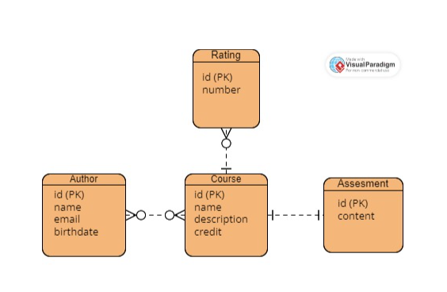

# Courses Project
This is going to be as descriptive as possible
## Libraries
# Task 2
In this project we use Task2 project as a dependency where it
contains
the blueprint of all the classes we use in our database. 
The classes (database tables) are divided into ("Course,Author,Assessment,Rating")
## The database ERD:

# Source
## Main
The Main Directory is divided into two packages "java and 
resources"

### Java
This is the mind of our project where everything happens. 

-  Repositories  
   in all classes we use JpaRepository in order 
to ensure your data types are compatible with the database's 
relational structure and to store the data.  
CourseRepository and AuthorRepository each one of them is used to 
implement the functions of jpa for each one of the corresponding 
class.
- Exceptions  
in this package we implement a response to every possible error
that could occur in our app to make the app respond in a way
that the user understands where he went wrong and fix things 
without the breaking of the app.
- Service  
in this package we create a class for each repository to implement
the behaviour of each of the corresponding table and avoiding any
error that could cause the app to break using the exceptions 
we made.
- Controller  
The controller package imports services package classes and functions
to use the outputs and send it to the endpoints either it's a
successful command or an error that needs to go the user
using RestController
- Mappers  
The mappers package is responsible to map the output of an object
to a similar object but with specific attributes minimizing 
direct dependencies between the application's core logic and 
the underlying database structure.
- task3  
This package contains Main class which is responsible for running
the spring app

## test
- Author
- Course  
Each one of these packages contains classes which does unitTesting
to ensure that all the services and controllers are working just fine.